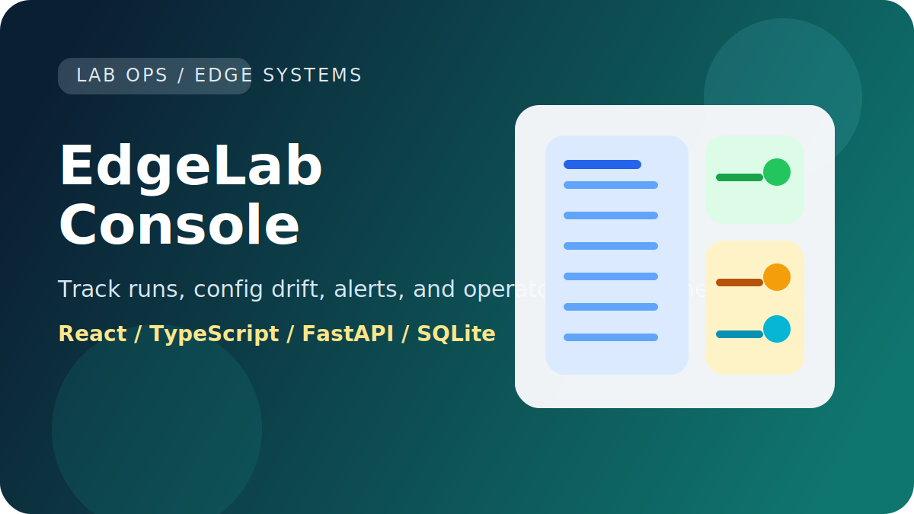

# EdgeLab Console

EdgeLab Console is a full-stack internal-tool style application for tracking device test runs, artifacts, alerts, and config drift across a busy lab environment.



The goal is to showcase the kind of work that sits between systems engineering, automation, and product-minded software:

- a clear dashboard for operators
- structured run detail views
- backend API design
- database-backed workflow data
- live signal updates
- note-taking and triage flow

## Stack

- Frontend: React, TypeScript, Vite
- Backend: FastAPI, SQLite
- Styling: custom CSS

## Features

- Overview dashboard with active runs, pass rate, and open alerts
- Filterable run queue by search, status, environment, and owner
- Run detail panel with config drift, artifacts, alerts, notes, and event timeline
- Live signal rail powered by a WebSocket endpoint
- Note composer for adding operator observations to a run

## What This Demonstrates

- Designing a credible internal-tool workflow instead of a generic CRUD app
- Presenting operational state, drift, and triage data in a calm way
- Structuring backend APIs around real lab workflows and handoffs
- Building a full-stack tool that feels useful to platform and validation teams

## Local Development

### Backend

```bash
cd backend
python -m venv .venv
.venv\Scripts\activate
pip install -r requirements.txt
uvicorn app.main:app --reload --port 8000
```

### Frontend

```bash
cd frontend
npm install
npm run dev
```

The Vite dev server proxies API traffic to `http://127.0.0.1:8000`.

## Why This Project

This project is designed to feel like a believable internal console a platform, lab automation, or device engineering team could actually use. It shows:

- practical UI design instead of portfolio-only styling
- structured APIs and domain modeling
- operational data presentation
- product thinking for noisy technical workflows

## Verification

- `python -m unittest discover -s backend\\tests -v`
- `python -m compileall backend\\app`
- `npm run build`
